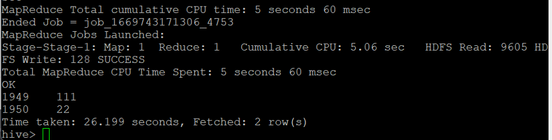
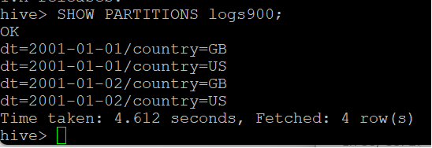
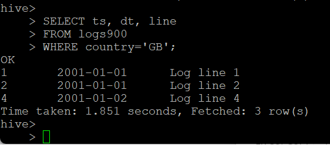
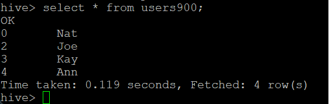
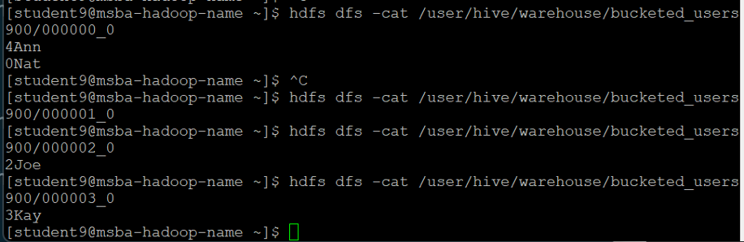
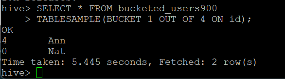
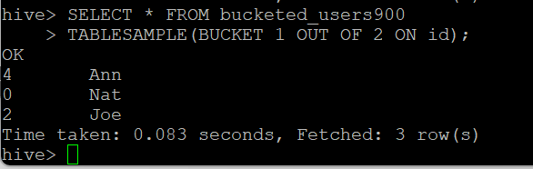
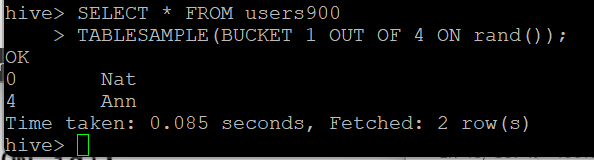

# Hive Data Processing Project

This project demonstrates the use of Apache Hive for managing and analyzing large datasets. Through exercises, we explore data import, table creation, and complex queries focusing on max temperature processing, data partitioning, and bucketing.

## Project Overview

- **Max Temperature Analysis**: Finds the highest temperature per year.
- **Data Partitioning**: Demonstrates partitioning for efficient querying.
- **Data Bucketing**: Shows how bucketing organizes data for better performance.

## Environment Setup

- **Platform**: CSUEB Hadoop
- **Tools**: Apache Hive
- **Data Sources**: Structured sample text files.

## Project Structure

### Max Temperature Analysis

#### Objective
Find the maximum temperature recorded for each year, excluding invalid entries.

#### Implementation
- Create `records900` table with year, temperature, and quality columns.
- Load data and query for maximum temperatures per year.

#### Visuals
```sql
-- Example HiveQL Query
DROP TABLE IF EXISTS records900;

CREATE TABLE records900 (year STRING, temperature INT, quality INT)
ROW FORMAT DELIMITED
  FIELDS TERMINATED BY '\t';

LOAD DATA LOCAL INPATH 'sample.txt'
OVERWRITE INTO TABLE records900;
```
```sql
-- Example HiveQL Query
SELECT year, MAX(temperature)
FROM records900
WHERE temperature != 9999 AND quality IN (0, 1, 4, 5, 9)
GROUP BY year;
```


### Data Partitioning

#### Objective
Partition data by date and country for more efficient data retrieval.

#### Implementation
- Create a partitioned table `logs900`.
- Load data with specific partitions and query by country.

#### Visuals
```sql
DROP TABLE IF EXISTS logs900;
##Note: Partitions are defined at table creation time using the PARTITIONED ##BYclause,[112]which takes a list of column definitions. 


CREATE TABLE logs900 (ts BIGINT, line STRING)
PARTITIONED BY (dt STRING, country STRING);

LOAD DATA LOCAL INPATH 'file1'
INTO TABLE logs900
PARTITION (dt='2001-01-01', country='GB');

LOAD DATA LOCAL INPATH 'file2'
INTO TABLE logs900
PARTITION (dt='2001-01-01', country='GB');

LOAD DATA LOCAL INPATH 'file3'
INTO TABLE logs900
PARTITION (dt='2001-01-01', country='US');

LOAD DATA LOCAL INPATH 'file4'
INTO TABLE logs900
PARTITION (dt='2001-01-02', country='GB');

LOAD DATA LOCAL INPATH 'file5'
INTO TABLE logs900
PARTITION (dt='2001-01-02', country='US');

LOAD DATA LOCAL INPATH 'file6'
INTO TABLE logs900
PARTITION (dt='2001-01-02', country='US');


SHOW PARTITIONS logs900;
```

```sql
SELECT ts, dt, line
FROM logs900
WHERE country='GB';
```




### Data Bucketing

#### Objective
Improve query performance through organizing data into buckets.

#### Implementation
- Create `users900` and `bucketed_users900` tables, with the latter bucketed by `id`.
- Insert data and use `TABLESAMPLE` to query a specific bucket.

#### Visuals
```sql
DROP TABLE IF EXISTS users900;

CREATE TABLE users900 (id INT, name STRING);

LOAD DATA LOCAL INPATH 'users.txt'
OVERWRITE INTO TABLE users900;

SELECT * FROM users900;
```


```sql
DROP TABLE IF EXISTS bucketed_users900;

CREATE TABLE bucketed_users900 (id INT, name STRING)
CLUSTERED BY (id) INTO 4 BUCKETS

INSERT OVERWRITE TABLE bucketed_users900
SELECT * FROM users900;

hdfs dfs -ls /user/hive/warehouse/bucketed_users900/
hdfs dfs -cat /user/hive/warehouse/bucketed_users900/000000_0
hdfs dfs -cat /user/hive/warehouse/bucketed_users900/000001_0
hdfs dfs -cat /user/hive/warehouse/bucketed_users900/000002_0
hdfs dfs -cat /user/hive/warehouse/bucketed_users900/000003_0

```

```sql
SELECT * FROM bucketed_users900
TABLESAMPLE(BUCKET 1 OUT OF 4 ON id);

```

```sql
SELECT * FROM bucketed_users900
TABLESAMPLE(BUCKET 1 OUT OF 2 ON id);
```

```sql
SELECT * FROM users900
TABLESAMPLE(BUCKET 1 OUT OF 4 ON rand());
```



## Usage

To run these Hive queries, follow these steps:

1. **Set up Hive environment**: Ensure Hive is properly configured on CSUEB Hadoop.
2. **Execute Queries**: Use the provided HiveQL scripts to create tables, load data, and perform queries.
3. **View Results**: Results can be seen directly in the Hive command line interface or in your Hadoop file system.


